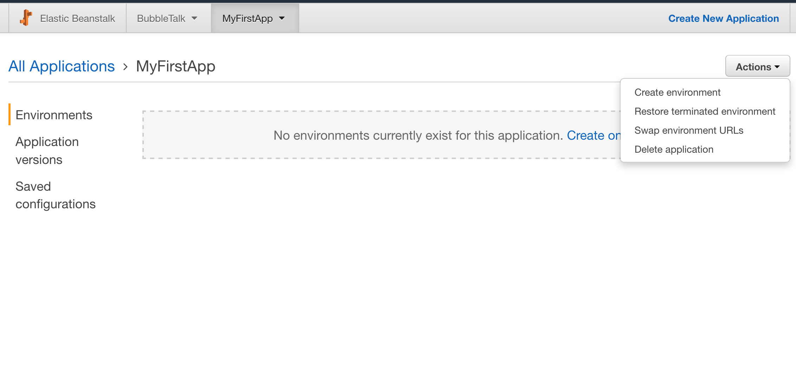
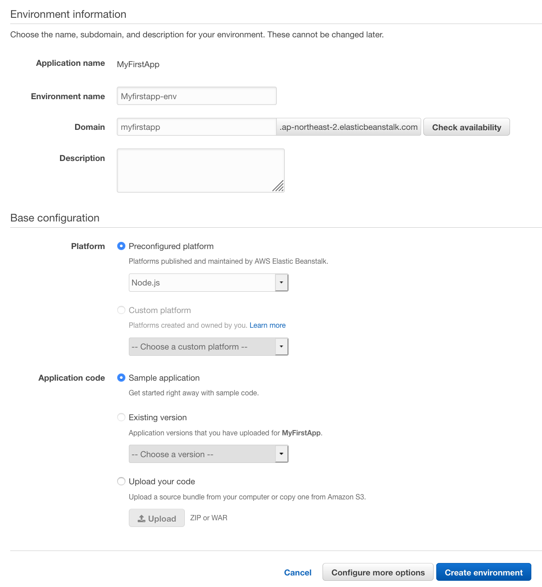
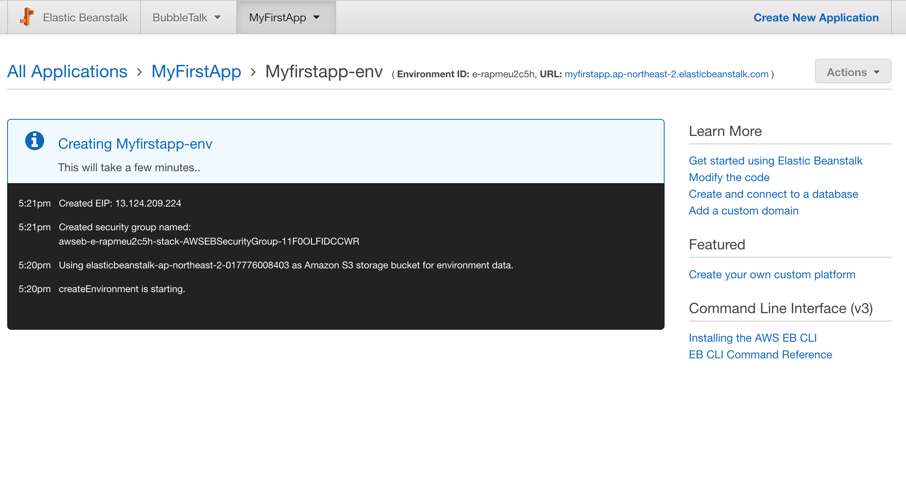
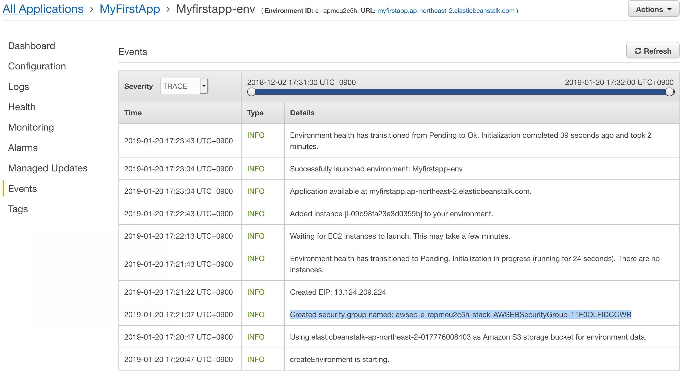
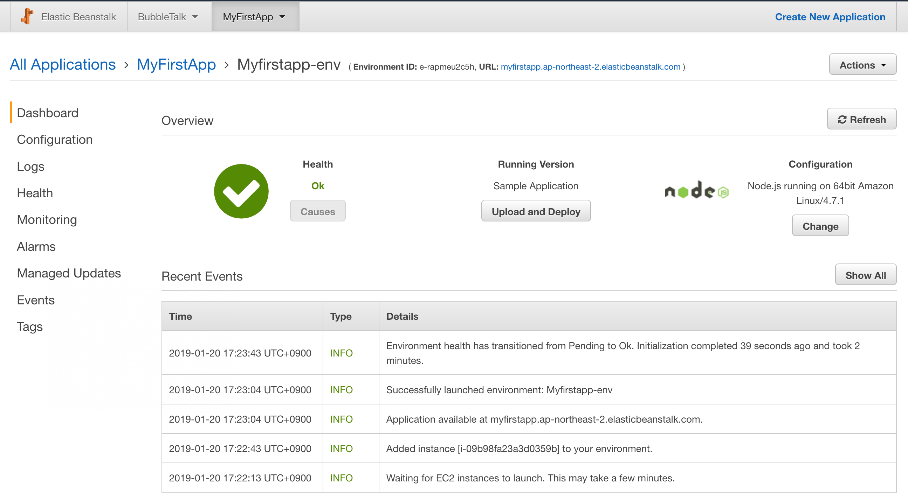
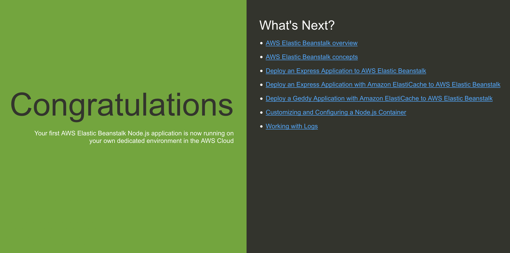
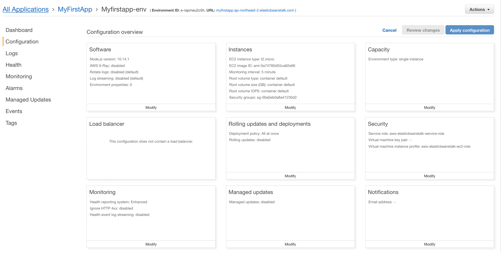
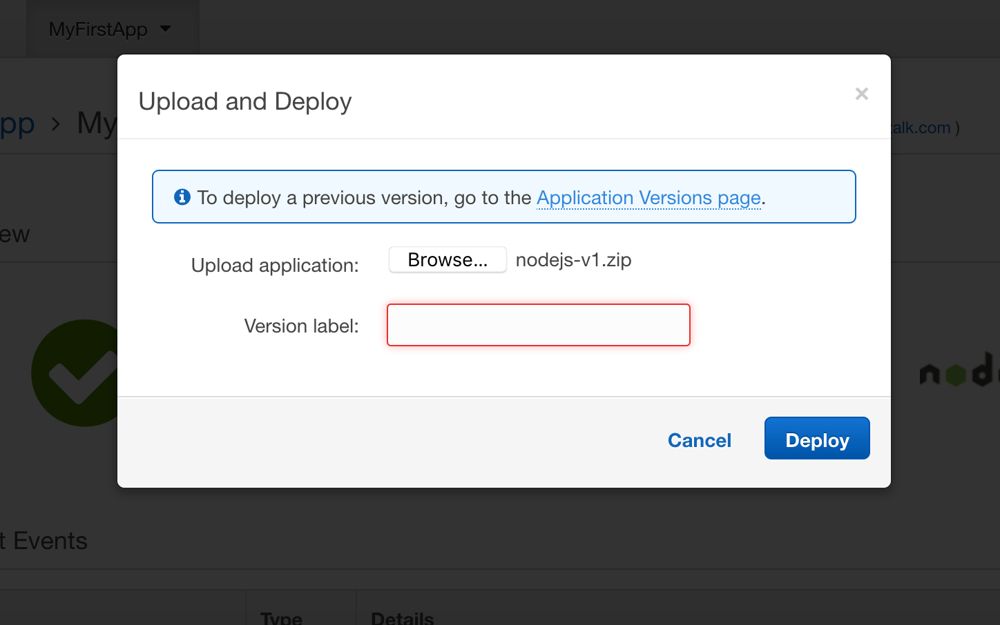

비공개 자료

# Mobile Client와 Server(Parse Server) 통신 튜토리얼

1. AWS 리눅스 서버 구축
2. 아마존 RDS Database
3. NodeJS의 Express를 사용하는 Parse Server를 AWS 서버에 Deploy 및 Database 연결
4. Cloud function 생성(Rest API) 및 호출 테스트
5. 모바일 클라이언트 로그인 구현
6. 클라이언트-서버 통신을 통한 서비스 구현

## 부재: AWS EB를 사용한 Parse Server 구축

- [Official](https://docs.aws.amazon.com)

- [Elastic Beanstalk](https://docs.aws.amazon.com/ko_kr/elasticbeanstalk/latest/dg/Welcome.html)

## AWS란

아마존에서 제공하는 클라우드 컴퓨팅

클라우드 컴퓨팅은 클라우드 서비스 플랫폼에서 컴퓨팅 파워, 데이터베이스 스토리지, 애플리케이션 및 기타 IT 리소스를 필요에 따라 인터넷을 통해 제공하고 사용한 만큼만 비용을 지불하는 것을 말합니다.

클라우드 컴퓨팅은 서버, 스토리지, 데이터베이스 및 광범위한 애플리케이션 서비스를 인터넷을 통해 간단하게 액세스할 수 있는 방법을 제공합니다. Amazon Web Services(AWS)와 같은 클라우드 서비스 플랫폼은 이러한 애플리케이션 서비스에 필요한 네트워크 연결 하드웨어를 소유하고 이에 대한 유지 관리를 담당하며, 사용자는 웹 애플리케이션을 통해 필요한 것을 프로비저닝하여 사용합니다.

## EB(Elastic Beanstalk)란?

Elastic Beanstalk를 사용하여 애플리케이션을 실행하는 인프라에 관계없이 AWS 클라우드에서 애플리케이션을 신속하게 배포하고 관리할 수 있습니다. AWS Elastic Beanstalk를 사용하면 선택이나 제어를 제한하지 않고 관리 복잡성을 줄일 수 있습니다. 애플리케이션을 업로드하기만 하면 Elastic Beanstalk에서 용량 프로비저닝, 로드 밸런싱, 조정, 애플리케이션 상태 모니터링에 대한 세부 정보를 자동으로 처리합니다. Elastic Beanstalk에서는 AWS 프리 티어에서 사용할 수 있는 안정성 및 확장성이 뛰어난 서비스를 사용합니다.

AWS Elastic Beanstalk는 Java, .NET, PHP, Node.js, Python, Ruby, Go, Docker를 사용하여 Apache, Nginx, IIS와 등에 배포하고 있는 웹 어플리케이션을 간편하게 배포하고 확장할 수 있는 서비스이다. Elastic Beanstalk를 사용하면 로컬 서버에서 웹 어플리케이션을 개발, 배포, 관리하는 것과 달리 작성한 코드를 업로드하기만 하면 자동으로 로드 밸런싱 애플리케이션 상태 모니터링 등 배포와 관리를 자동으로 처리할 수 있습니다.

한마디로 가상 서버 환경 구축, 관리, 로드 밸런싱, RDS(Relation Database Service) 등의 컨트롤을 한번에 할 수 있도록 구성되어 있는 웹 업플리케이션 관리, 배포 서비스입니다.

## 튜토리얼

### AWS 게정 생성

https://console.aws.amazon.com/

### 애플리케이션 생성

Elastic Beanstalk는 무료로 사용할 수 있지만, 여기에서 제공하는 AWS 리소스는 실시간으로 활성화됩니다(샌드박스에서 실행되지 않음). 이 자습서의 마지막 작업에서 이러한 리소스를 종료하지 않으면 해당 리소스에 대한 표준 사용 요금이 발생합니다.(일반적으로 1달러 미만)

[생성하기](https://ap-northeast-2.console.aws.amazon.com/elasticbeanstalk/home?region=ap-northeast-2)

지역: 서울로 변경 후 Create New Application 을 통해 생성

앱 이름 및 도메인 이름은 원하는대로 입력하세요. (여기서는 MyFirstApp 사용)

사진

### 웹 서비스 환경 구축 (서버 생성)

일반적으로 이곳에 개발용 환경, 배포용 환경을 따로 만들어 사용하기도 합니다. 저희는 바로 배포용 환경 하나만 구축해서 사용하도록 하겠습니다.

1. Actions -> Create environment

2. Web server environment 선택

3. 이름 정하고 Preconfigured platform은 Node.js로 선택

4. Application Code는 Sample Application 선택

5. Create Environment 클릭

### Create Environment의 동작

AWS 리소스에서 샘플 애플리케이션을 실행하기 위해 Elastic Beanstalk에서는 다음 작업을 수행하며 완료되는 데는 약 5분이 걸립니다.

생성 직후 Events를 보면 아래 과정이 나열되어 있는 것을 볼 수 있습니다.

AWS 리소스가 있으며 이름이 GettingStartedApp-env인 환경을 시작합니다.

	EC2 인스턴스 – 선택한 플랫폼에서 웹 앱을 실행하도록 구성된 Amazon Elastic Compute Cloud(Amazon EC2) 가상 머신입니다.

	특정 언어 버전, 프레임워크, 웹 컨테이너 또는 조합을 지원하도록 각 플랫폼마다 실행하는 소프트웨어, 구성 파일 및 스크립트 세트가 다릅니다. 대부분의 플랫폼에서는 웹 앱 앞에 위치해 웹 앱으로 요청을 전달하고, 정적 자산을 제공하고, 액세스 및 오류 로그를 생성하는 역방향 프록시로 Apache 또는 nginx를 사용합니다.

	인스턴스 보안 그룹 – 포트 80에서 수신을 허용하도록 구성된 Amazon EC2 보안 그룹입니다. 이 리소스를 통해 로드 밸런서의 HTTP 트래픽이 웹 앱을 실행하는 EC2 인스턴스에 도달할 수 있습니다. 기본적으로 다른 포트에서는 트래픽이 허용되지 않습니다.

	Amazon S3 버킷 – Elastic Beanstalk 사용 시 생성된 소스 코드, 로그 및 기타 결과물의 스토리지 위치입니다.

	Amazon CloudWatch 경보 – 환경의 인스턴스에 대한 로드를 모니터링하는 두 개의 CloudWatch 경보로, 로드가 너무 높거나 너무 낮은 경우 트리거됩니다. 경보가 트리거되면 이에 대한 응답으로 그룹이 확장 또는 축소됩니다.

	AWS CloudFormation 스택 – Elastic Beanstalk에서는 AWS CloudFormation을 사용하여 사용자 환경의 리소스를 시작하고 구성 변경 사항을 전파합니다. 리소스는 AWS CloudFormation 콘솔에서 볼 수 있는 템플릿에서 정의됩니다.

	도메인 이름 – subdomain.region.elasticbeanstalk.com 형식으로 웹 앱으로 라우팅되는 도메인 이름입니다.

기본 Elastic Beanstalk 샘플 애플리케이션 파일을 나타내는 Sample Application이라는 새 애플리케이션 버전을 만듭니다.(S3에 저장)

샘플 애플리케이션 코드를 MyFirstApp-env에 배포합니다.

### Environment 확인

생성된 URL을 통해 동작을 확인한다.

Configuration 메뉴를 통해 현재 서비스의 리소스들을 확인할 수 있다.

### 웹앱 업로드 및 배포

환경에서 다른 업데이트 작업이 현재 진행 중이지 않은 한 언제든지 새 애플리케이션 버전을 배포할 수 있습니다.

아마존에서 제공하는 nodejs 샘플 앱을 올려보겠습니다.
파일 다운로드 링크 Node.js – [nodejs-v1.zip](https://docs.aws.amazon.com/ko_kr/elasticbeanstalk/latest/dg/samples/nodejs-v1.zip)

1. Upload and Deploy를 통해 업로드

3. URL로 들어가서 확인

새 애플리케이션 버전이 업로드되고 애플리케이션 버전 테이블에 추가됩니다. 배포된 테이블을 보려면 애플리케이션 버전 페이지를 선택하여 볼 수 있습니다.

## 환경 구성 변경하기

애플리케이션에 더 적합하도록 환경을 사용자 지정할 수 있습니다. 예를 들어 컴퓨팅 집약적인 애플리케이션이 있는 경우 애플리케이션을 실행 중인 Amazon EC2 인스턴스의 유형을 변경할 수 있습니다.

일부 구성은 변경이 간단하고 빠르게 처리되지만 일부 변경의 경우 Elastic Beanstalk가 AWS 리소스를 삭제한 후 다시 만들어야 하며, 여기에는 몇 분 정도 걸릴 수 있습니다. Elastic Beanstalk는 구성 설정을 변경할 때 발생할 수 있는 애플리케이션 가동 중지에 대해 경고합니다.

이 작업에서 환경의 용량 설정을 편집합니다. Auto Scaling 그룹에 2~4개의 인스턴스가 있는 로드 밸런싱 자동 조정 환경을 구성한 다음 변경이 발생했는지 확인합니다. 두 개의 인스턴스가 생성되고 환경의 로드 밸런서에 연결됩니다. 이러한 인스턴스는 가 처음 생성한 단일 인스턴스를 대체합니다.

환경 구성을 변경하려면 다음을 수행합니다.

1. Elastic Beanstalk 콘솔을 엽니다.
2. 해당 환경의 관리 페이지로 이동합니다.
3. Configuration을 선택합니다.
4. 용량 구성 카드에서 수정을 선택합니다.

## 삭제
미리 버전을 삭제하고  혹시 놓칠 경우 S3 삭제를 잊지 말것.