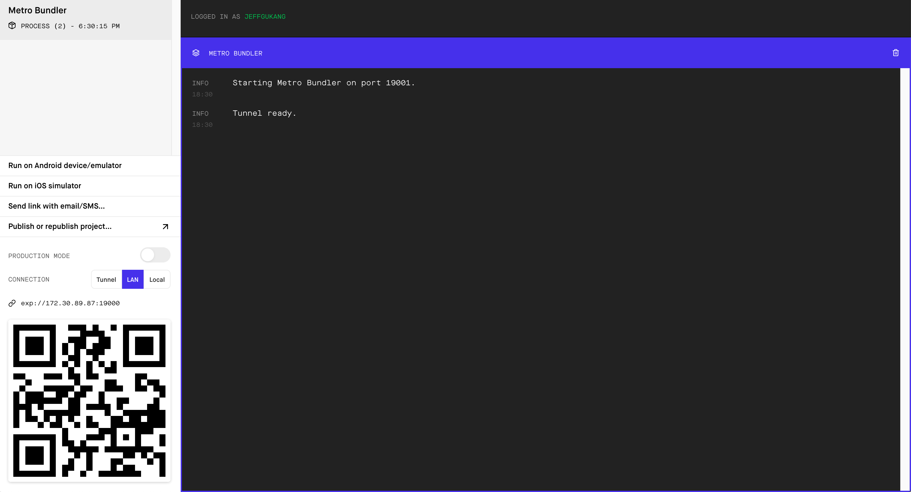
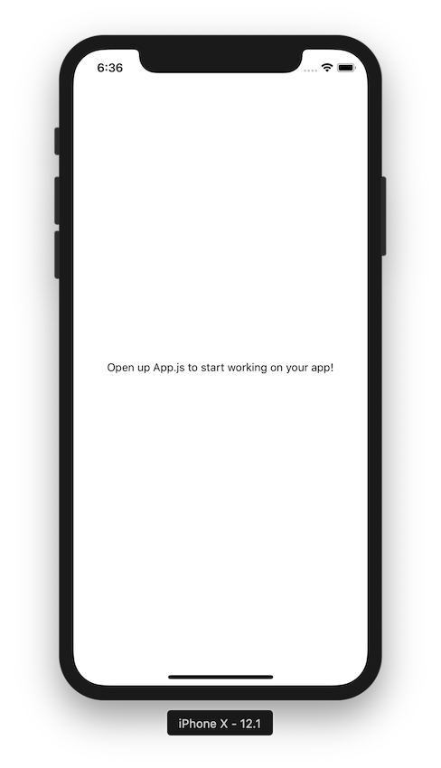
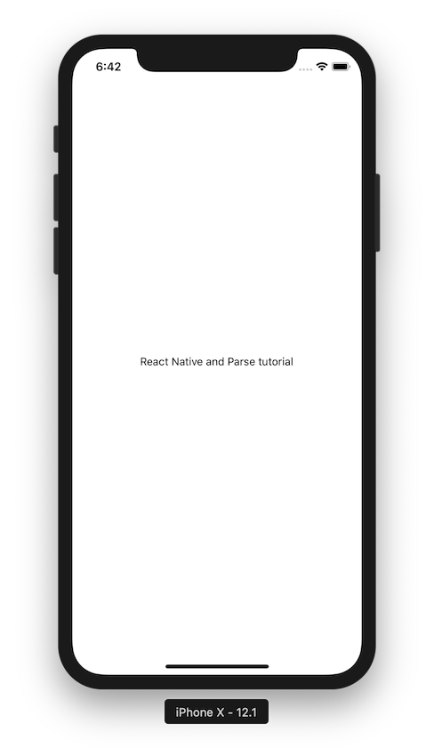
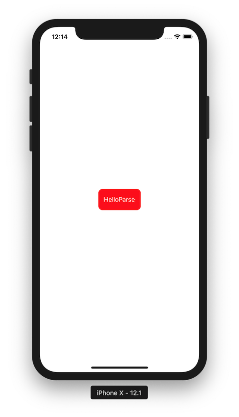
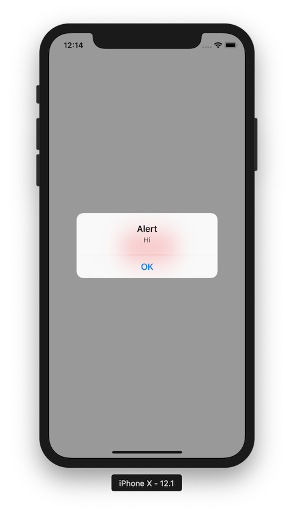
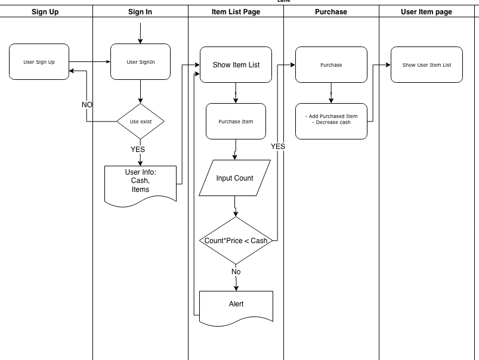
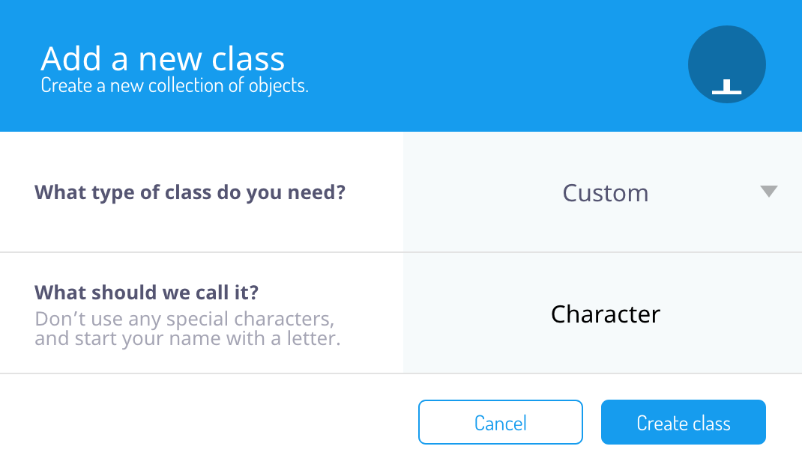
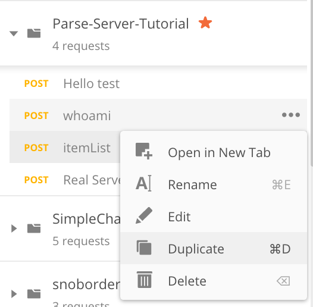
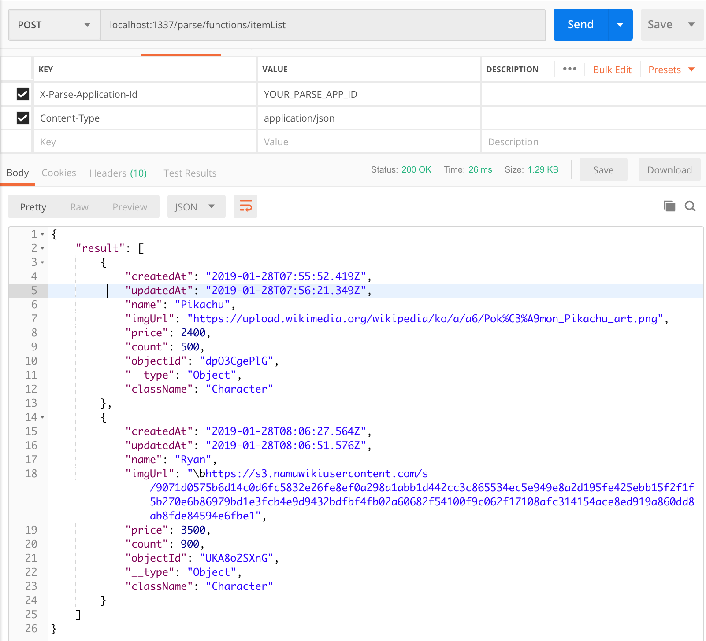

# React Native 애플리케이션과 서버 통신 튜토리얼 1

앞의 튜토리얼에서

1. AWS EB를 사용하여 NodeJS 서버 구축하기
2. 로컬에 Parse-Server, Parse-Dashboard 및 PostgreSQL 설치 튜토리얼
3. 로컬에 구축한 서버 환경을 AWS EB로 배포 튜토리얼

를 통하여 실제 서버를 AWS EB에 구동을 시켜보았습니다.

이제는 React Native 기반 모바일 애플리케이션에서 해당 서버에 접속 및 API를 통한 통신을 구현해보겠습니다. 다만 여기에서는 React Native의 기초에 관해서는 다루지 않습니다. React Native 기초 튜토리얼은 [이곳](https://github.com/JeffGuKang/ReactNative-Tutorial)을 참조하세요. (도움이 되었다면 **Star**를!)

1. Expo를 통한 React Native 애플리케이션 환경 구축
2. 리액트 네이티브에 Parse SDK 설치
3. 리액트 네이티브에서 Parse 서버와 통신하기
4. 애플리케이션에서 서버 API를 호출하여 백엔드 데이터베이스 수정하기

## Expo를 통한 React Native 애플리케이션 환경 구축

이제 잠시 혼자 돌아가고 있는 백엔드 서버는 뒤로하고 리액트 네이티브를 사용해 차후 서버와 통신을 하게 될 모바일 애플리케이션을 만들어보도록 하겠습니다.

### 리엑트 네이티브란

> React Native lets you build mobile apps using only JavaScript. It uses the same design as React, letting you compose a rich mobile UI using declarative components.

페이스북이 2015년에 오픈소스로 공개한 리엑트 라이브러리 기반의 모바일 애플리케이션 프레임워크입니다. 현재 Android/iOS를 주력으로 지원하며 기존 모바일 웹뷰를 감싼 Ionic, Cordova과 같은 하이브리드 앱과는 다르게 네이티브로 실행된다는 점을 장점으로 내세우고 있습니다. 현재 버전은 0.58번대이며 구글에서 발표한 다트 언어를 사용하는 flutter(플러터)와 비슷한 컨셉을 가지고 있습니다.

하지만 flutter가 컴파일 과정에서 Dart 코드를 ARM 기반으로 변환하여 네이티브로 구동시키는 것과 달리 리엑트 네이티브는 자바 스크립트 엔진 상에서 돌아가는 자바 스크립트 코드를 네이티브 브릿지를 통해 실시간으로 연결합니다.

네이티브에 뒤지지 않는 퍼포먼스를 내며 많은 개발자들에게 친숙한 자바스크립트를 사용할 수 있고, 이미 존재하는 많은 수의 패키지 모듈들을 사용하여 빠르게 개발하고, 한 소스로 멀티 플랫폼을 커버할 수 있다는 점에서 각광받고 있습니다.

### Expo 환경 구축

#### Expo란

> Expo is a free and open source toolchain built around React Native to help you build native iOS and Android projects using JavaScript and React.

엑스포는 리엑트 네이티브 개발을 위한 오픈소스 툴체인입니다. 편리한 개발환경을 지원하고 많이 유용한 라이브러리들이 기본적으로 포함되어 있습니다. 다만 실제 프로덕트나 네이티브 기능을 사용하는 추가모듈을 사용해야 하는 상황에서는 expo eject를 통해 엑스포 환경을 걷어내야 하는 경우가 있습니다.

#### 1. Expo 설치

Expo(엑스포) 역시 앞에 사용한 Parse Server와 마찬가지로 npm을 통해 설치할 수 있습니다.

```s
npm install expo-cli --global
```

or

```s
yarn global add expo-cli
```

#### 2. 프로젝트 시작

```s
expo init my-new-project
```

선택지에서 각 blank, managed 를 선택해주세요.

- Choose a template: blank
- Choose which workflow to use: managed (default)

관련 모듈들을 다운받고 완료가 되었으면 프로젝트를 실행해봅니다.

```
cd my-new-project
expo start
```



#### 3. 시뮬레이터를 통한 앱 실행

좌측 사이드바에서 시뮬레이터를 실행하여 결과물을 봅니다.



iOS 시뮬레이터의 경우 맥에서 가능합니다. 자동실행됩니다.
안드로이드의 경우 디바이스를 연결하거나 시뮬레이터를 미리 동작시킨 상태여야 테스트가 가능합니다.

#### 4. 소스 수정 및 테스트

`App.js`에서 `<Text>` 컴포턴트 내용을 수정해보세요.

```js
import React from 'react';
import { StyleSheet, Text, View } from 'react-native';

export default class App extends React.Component {
  render() {
    return (
      <View style={styles.container}>
        <Text>React Native and Parse tutorial</Text>
      </View>
    );
  }
}

const styles = StyleSheet.create({
  container: {
    flex: 1,
    backgroundColor: '#fff',
    alignItems: 'center',
    justifyContent: 'center',
  },
});
```

시뮬레이터에서 새로고침을 하고 반영된 결과를 확인합니다.



### 리액트 네이티브에 Parse SDK 설치

본격적으로 Parse를 설치하고 전 튜토리얼에서 만든 로컬 서버 및 AWS 서버와 통신을 해보도록 하겠습니다.

1. 콘솔에서 ctrl+c를 통해 expo를 중단하고 npm을 통해 parse를 설치합니다.

```js
npm install parse --save
```

2. Parse를 리액트 네이티브에서 사용하기

저희는 별도의 파일로 관리하도록 하겠습니다.
일단 srcs/libs/parseApi.js 파일을 만들고 아래 코드를 적습니다.

srcs/libs/parseApi.js

```js
// In a React Native application
import Parse from 'parse/react-native';

//Get your favorite AsyncStorage handler with import (ES6) or require
import { AsyncStorage } from 'react-native';
Parse.setAsyncStorage(AsyncStorage);
Parse.initialize("YOUR_PARSE_APP_ID");

Parse.serverURL = 'http://localhost:1337/parse' // local
```

대략적으로 훑어보겠습니다.

Parse 라이브러리를 import합니다.

```js
import Parse from 'parse/react-native';
```

React Native는 key-value 저장 시스템으로 AsyncStorage를 사용합니다. Parse에 이것을 적용해줍니다.

그 후 initialize에 기존 파스 서버에서 정의한 app id를 넣어 초기화를 시킵니다.

```js
import { AsyncStorage } from 'react-native';
Parse.setAsyncStorage(AsyncStorage);
Parse.initialize("YOUR_PARSE_APP_ID");
```

이제 React Native에서 Parse를 사용할 준비가 되었습니다.

### 리액트 네이티브에서 Parse 서버와 통신하기

#### 1. 로컬 서버 실행하기

일단 [전 튜토리얼](./Tutorial1.md)에서 사용한 Parse Server를 테스트를 위해 로컬로 실행하도록 하겠습니다.

해당 Parse Server 프로젝트 폴더에서

```s
npm start:local
```

를 통해 로컬로 실행시킵니다. DB서버가 실행되고 있어야 정상적인 실행이 가능합니다.

#### 2. 클라이언트 코드 작성하기

Parse Server에 있는 hello Api를 호출하고 응답을 받는 코드를 작성하도록 하겠습니다.

Parse를 초기화한 부분 아래에 ParseApi라는 클래스를 작성합니다. 그리고 `sayHello`라는 static 함수를 작성하겠습니다. 차후 이 함수는
`ParseApi.sayHello();` 이런 식으로 호출하여 사용할 것입니다.

외부에서 사용하기 위해 export 하는것을 잊지 마세요.

srcs/libs/parseApi.js

```js
...

class ParseApi {
  static sayHello = async () => {
    const response = await Parse.Cloud.run('hello');
    return response;
  }
}

export default ParseApi;
```

#### 3. UI 코드 작성

ParseApi를 import하여 버튼을 누르면 `sayHello`를 호출하고 응답을 alert으로 보여주는 코드입니다.

App.js

```js
import React from 'react';
import { StyleSheet, Text, View, TouchableOpacity } from 'react-native';

import ParseApi from './srcs/libs/parseApi';

export default class App extends React.Component {
  onPressHello = async () => {
    const result = await ParseApi.sayHello();
    alert(result);
  }

  render() {
    return (
      <View style={styles.container}>
        <TouchableOpacity onPress={this.onPressHello}>
          <View style={styles.button}>
            <Text style={{color: 'white', fontSize: 15}}>HelloParse</Text>
          </View>
        </TouchableOpacity>
      </View>
    );
  }
}

const styles = StyleSheet.create({
  container: {
    flex: 1,
    backgroundColor: '#fff',
    alignItems: 'center',
    justifyContent: 'center',
  },
  button: {
    backgroundColor: 'red',
    borderRadius: 10,
    height: 50,
    width: 100,
    justifyContent: 'center',
    alignItems: 'center',
  }
});
```



onPressHello 라는 async 함수를 만들어 ParseApi에서 sayHello라는 static 함수를 호출하고 결과를 alert창을 통해 보여주는 코드입니다.

```js
onPressHello = async () => {
  const result = await ParseApi.sayHello();
  alert(result);
}
```

HelloParse라는 버튼을 누르면 `onPressHello` 함수를 통해 파스 서버의 응답을 받아 alert의 그 결과를 보여주는 것을 볼 수 있습니다.

```js
<TouchableOpacity onPress={this.onPressHello}>
  <View style={styles.button}>
    <Text style={{color: 'white', fontSize: 15}}>HelloParse</Text>
  </View>
</TouchableOpacity>
```



클라이언트에서 로컬 서버의 api를 호출해 보았습니다.

#### 4. AWS 서버와 통신하기

위 내용을 응용하여 현재 Elastic Beanstalk를 통해 구동되고 있는 서버를 대상으로 테스트를 해 보세요.

힌트를 드리면

```js
Parse.serverURL = 'http://localhost:1337/parse' // local
```

이 부분입니다.

## 애플리케이션에서 서버 API를 호출하여 백엔드 데이터베이스 수정하기

백엔드 서버를 사용하는 일반적은 서비스들은 클라이언트에서 서버의 API를 호출하고 데이터베이스 관련 작업은 백엔드에서 전담하는 경우가 많습니다.

이번 챕터에서는 백엔드에서 데이터베이스를 업데이트하는 api를 추가하고 클라이언트에서 그것을 호출하여 응답을 처리하는 과정을 진행해 보겠습니다.



대략적으로 상품 리스트가 있고 유저가 특정 상품을 구매하는 형식의 애플리케이션을 구상해보았습니다.

### 데이터베이스에 상품 리스트 추가하기

캐릭터에 대한 가상 주식을 상품으로 정하고 데이터베이스에 해당 내역을 추가해보도록 하겠습니다.

간단하게 이름, 이미지주소, 가격, 갯수로 데이터베이스 스키마를 구성하였습니다.

Character
- name
- imgUrl
- price
- count

예를 들면

- imgUrl: 
- name: 피카츄
- price: 1000
- count: 500

이런 식입니다.

#### 1. 로컬에서 parse dashboard 실행

로컬 데이터베이스에 해당 데이터 구조를 생성해 보겠습니다.
현재 로컬로 실행되고 있는 parse server 프로젝트에서 미리 작성된 `npm run dashboard:local` 스크립트를 통해 Parse Dashboard를 실행합니다. 오리지날 커맨드는 `parse-dashboard --config parse-dashboard-config-local.json` 입니다.

```s
$ npm run dashboard:local

> parse-dashboard --config parse-dashboard-config-local.json

The dashboard is now available at http://0.0.0.0:4040/
```

Parse Server 설정값인 `config/default.json` 파일의 appId, masterKey 등이 `parse-dashboard-config-local.json` 파일과 일치해야 정상실행됩니다.

정상 실행 후 `http://0.0.0.0:4040/` 주소를 통해 대쉬보드를 접속할 수 있습니다.



Parse Server에서 기본적으로 생성하는 User 클래스와 Role이 보입니다. 현재 로컬 데이터베이스인 PostgreSQL를 Parse Dashboard를 통해 보여주고 있다고 생각하셔도 무방합니다. (실제로는 Parse Server를 통하기 때문에 조금 다른 개념입니다. )

#### 2. 새로운 클래스 생성하기

이제 좌측 사이드바에 있는 Create a class 버튼을 통해 새로운 클래스를 생성합니다. 지금 사용하고 있는 Parse Dashboard는 Parse Server의 master key를 사용하고 있기 때문에 클래스 생성, 삭제, 수정 등의 관리자 권한이 필요한 동작이 가능합니다.
master key 설정값은 `config/default.json` 및 `parse-dashboard-config-local.json`를 참고하세요.

새로 생성할 클래스 이름은 Character로 정하겠습니다.



생성된 Character 클래스를 보면 기본적으로 생성되어 있는 columns은 다음과 같습니다.

- objectID: 고유 ID
- createAt: 생성 시간
- updatedAt: 업데이트 시간
- ACL: 권한 관련



이제 여기에 새로운 columns을 생성하겠습니다.

- name: String
- imgUrl: String
- price: Number
- count: Number

`Add a new column` 버튼 혹은 `Edit -> Add a row`를 통해 위 column들을 각각 생성해줍니다. type 선택에 유의하세요.




#### 3. 데이터 입력하기

Add Row 버튼을 통해 데이터를 입력합니다. 해당 column에서 더블클릭으로 입력 가능합니다.


**피카츄**
- name: Pikachu
- imgUrl: https://upload.wikimedia.org/wikipedia/ko/a/a6/Pok%C3%A9mon_Pikachu_art.png
- price: 2400
- count: 500

**라이언**
- name: Ryan
- imgUrl: https://s3.namuwikiusercontent.com/s/9071d0575b6d14c0d6fc5832e26fe8ef0a298a1abb1d442cc3c865534ec5e949e8a2d195fe425ebb15f2f1f5b270e6b86979bd1e3fcb4e9d9432bdfbf4fb02a60682f54100f9c062f17108afc314154ace8ed919a860dd8ab8fde84594e6fbe1
- price: 3500
- count: 900

자 이제 데이터베이스에 원하는 캐릭터들을 추가하였습니다. 재미를 위해 본인이 원하는 다른 캐릭터들도 추가해보세요.

### 서버에 상품 리스트 가져오는 api 추가하기

자 이제 클라이언트에서 캐릭터들을 보여주고 주식 가격을 알려주기 위해서는 서버에서 데이터베이스의 내용을 보여주는 api가 필요합니다. Parse Server에 해당 api를 작성하도록 하겠습니다.

#### 1. api 추가하기

cloud/functions/index.js 에 아래 코드를 추가하세요.

```js
Parse.Cloud.define('getItemList', async (req) => {
  const Character = Parse.Object.extend('Character'); // Get class from database
  const query = new Parse.Query(Character); // Make query from class

  try {
    const result = await query.find(); // Get all datas
    return result;
  } catch (error) {
    throw error;
  }
});
```

#### 2. 바로 테스트하기

전에 사용했던 Postman을 다시 사용해서 테스트를 해보도록 하겠습니다.
기존에 api 호출을 위해 사용했었던 것을 복사하여 주소만 바꿔주세요.

기존것을 복사



주소를 `localhost:1337/parse/functions/whoami`로 바꾸었습니다.


`Headers` 에 `X-Parse-Application-Id`이 잘 설정되어 있나 확인해주세요.

그리고 Send를 통해 해당 주소에 `Post`를 날리면



짠~!
result 안에 배열로 결과들이 나온것을 볼 수 있습니다. 잘 동작하네요.

#### 3. 코드 훑어보기

코드의 이해를 돕기 위해 위에 사용된 코드를 훑어보도록 하겠습니다.

```js
Parse.Cloud.define('getItemList', async (req) => {
  ...
}
```

이 코드는 Parse Server에서 외부에서 호출 가능한 API를 정의하는 코드입니다. Parse에서는 클라우드 코드라 명명하고 있습니다. `getItemList`라는 API를 선언하였고 `async (req) => {}` 로 비동기 함수를 정의하였습니다.

`req`는 API를 호출한 외부 정보를 담고 있습니다. 특히 사용자 입력은 `req.params`를 통해 전달받을 수 있습니다.

```js
const Character = Parse.Object.extend('Character');
```

데이터 베이스에서 Class 오브젝트를 가져옵니다.

```js
const query = new Parse.Query(Character); // Make
```

Class로부터 쿼리를 생성합니다. 이 쿼리에 특정 조건들을 선언할 수 있습니다. 예로 pickachu란 이름의 데이터만 찾고 싶으면 `query.equalTo('name', 'pickachu')` 이런식으로 사용 가능합니다. 저희는 모든 데이터를 가져오기 위해 아무것도 설정하지 않았습니다.

```js
try {
  const result = await query.find(); // Get all datas
  return result;
} catch (error) {
  throw error;
}
```

try-catch 문은 try블록 내의 코드를 실행할 시 에러가 발생하면 catch로 해당 에러를 넘겨 처리하도록 하는 예외처리(exception) 문법입니다. 

`query.find()`를 통해 `Character` 안의 데이터들을 비동기로 가져오고 그 결과를 `result`로 받습니다. 그 후 `return result`를 통해 응답으로 던져줍니다. `query.find()`에서 에러가 발생할 경우 그 에러를 `throw error`를 통해 역시 응답으로 던져줍니다.

여기서 컴파일, 문법 관련 발생하는 에러는 해당되지 않고 동작시 발생하는 에러만 처리 가능하다는 걸 참고하세요.

**async/await**

비동기 함수를 다루기 위해 사용되는 async await 에 관한 것은 [Async/Await](https://javascript.info/async-await)에 설명이 되어 있습니다. 간단히 말하면 비동기로 사용할 함수를 async를 통해 선언하고(난 await를 쓸것이야 라고 미리 알려주는 것) 함수 스코프 내에서 사용하는 비동기 함수 앞에 await를 붙여 해당 비동기 함수의 결과값이 리턴될때까지 다음 처리를 기다리는 것입니다. 그러므로 `await query.find()` 는 비동기 함수인 query.find()의 응답을 기다렸다가 그 응답을 `const result`를 통해 받게 되는 것입니다. `await`가 선언되지 않았다면 응답을 기다리지 않고 바로 다음 코드가 실행되며 result는 함수의 결과값이 아닌 해당 함수 그 자체를 가리키게 됩니다.

## Conclusion

- 리액트 네이티브로 만든 모바일 클라이언트를 통해 백엔드 api 호출
- 데이터베이스 클래스 생성 및 데이터 추가
- Parse Server에 api 추가
- 외부에서 백엔드 api를 호출해 데이터 응답 확인

자 여기까지 데이터베이스에 직접 데이터를 넣어 보고 외부에서 API 호출을 통해 데이터값을 받는것을 해 보았습니다. 다음 과정에는 실제로 모바일 클라이언트에서 데이터를 받아 처리하고 보여주는 것을 해 보겠습니다.

## 참조

- [Parse 공식 가이드 문서](https://docs.parseplatform.org/js/guide/)
