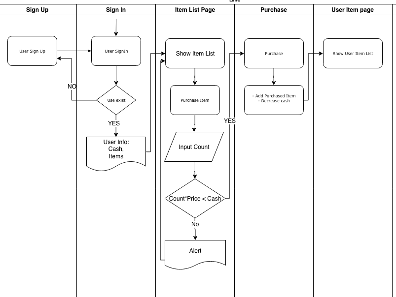
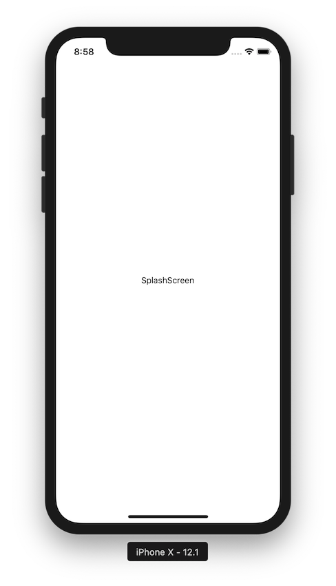
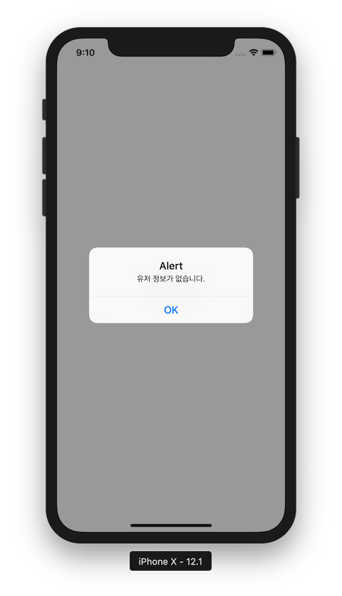
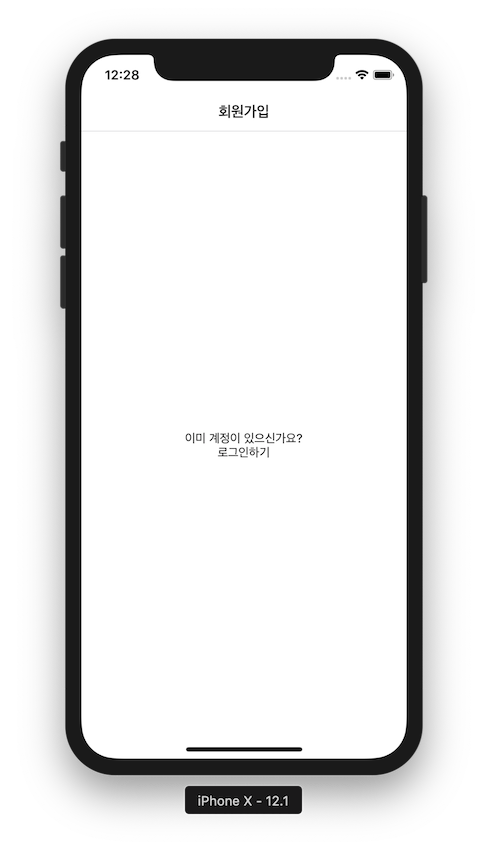
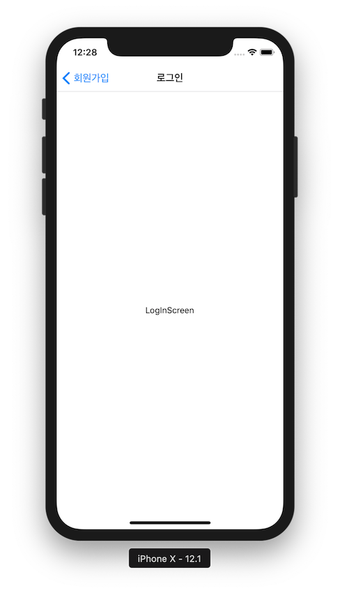
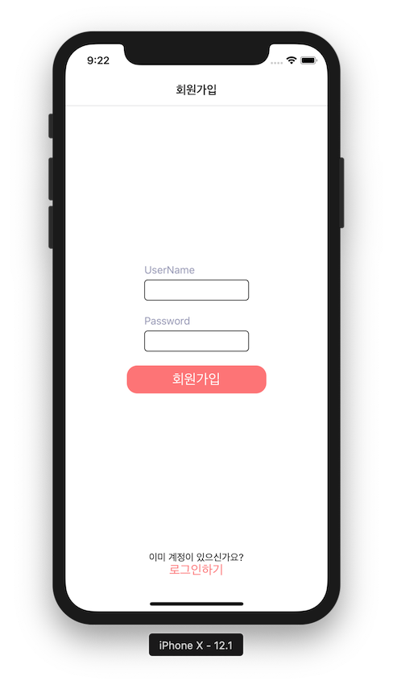

# React Native 애플리케이션과 서버 통신 튜토리얼 2

앞 튜토리얼에서는

1. Expo를 통한 React Native 애플리케이션 환경 구축
2. 리액트 네이티브에 Parse SDK 설치
3. 리액트 네이티브에서 Parse 서버와 통신하기
4. 데이터 베이스에 상품 리스트를 추가하고 테스트하기

를 해 보았습니다.

이제 전체적인 흐름은 파악이되었으니 본격적으로 클라이언트를 만들어 보도록 하겠습니다.

기본적인 구성과 화면 설정을 위해

1. React Navigation 적용
2. 스타일 정의
3. 유저 정보에 따른 화면 분기하기
3. 회원가입 화면 구성하기

을 할 것이며 기존 시나리오를 바탕으로 화면을 구성할 것입니다.

1. 유저 로그인
2. 상품 리스트 확인
3. 특정 상품 구매
4. 보유 상품 리스트 확인
5. 특정 상품 판매



## React Navigation 적용

화면간의 전환을 위해 [React Navigation](https://reactnavigation.org)을 사용하도록 하겠습니다. [React Navigation](https://reactnavigation.org)은 페이스북에서도 권장하고 있는 독립된 네비게이션 라이브러리 입니다.

> [Navigating Between Screens](https://facebook.github.io/react-native/docs/navigation)

### 1. React Navigation 설치

버전이 바뀔 때마다 조금씩 변하는 부분이 있으니 공식 문서를 확인하여 설치합니다.

> [공식문서](https://reactnavigation.org/docs/en/getting-started.html)

현재 3.x 버전이며 2.x 버전과 다르게 `react-native-gesture-handler`의 추가 설치를 요구합니다. 다만 Expo 환경에서는 `react-native-gesture-handler`가 기본적으로 설치되어 있으므로 추가로 설치하지 않아도 괜찮습니다.

```
npm install react-navigation --save
```

### 2. 화면 스키마 구성하기

플로우차트에서 기획한 것처럼

1. 회원 가입
2. 로그인
3. 아이템 리스트 페이지
4. 구매 페이지
5. 유저 아이템 리스트 페이지

를 바탕으로 화면을 구성해 보겠습니다.

- 로딩 화면
- 로그인 관련
	- 로그인
	- 회원 가입
- 동작 화면
	- 아이템 리스트 페이지
		- 구매 페이지
	- 유저 아이템 리스트 페이지

### 3. 화면별 컴포넌트 생성
React Native 프로젝트에서 `screens`라는 폴더를 만들고 그 안에 각각

- SplashScreen.js
- LogInScreen.js
- SignUpScreen.js
- ItemListScreen.js
- PurchaseScreen.js
- UserItemListScreen.js

파일을 생성하였습니다.

각 파일을 열어

```js
import React, {
  Component
} from 'react'
import {
  Text,
  View,
  StyleSheet
} from 'react-native'

export default class SplashScreen extends Component {
  render() {
    return (
    <View style={styles.container}>
      <Text> SplashScreen </Text>
    </View>
    )
  }
}

const styles = StyleSheet.create({
  container: {
    flex: 1,
    alignItems: 'center',
    justifyContent: 'center',
  },
});
```

이런 식으로 기본적인 스크린 컴포넌트를 각각 생성해줍시다.

LogInScreen.js 라면 `SplashScreen` 대신 `LogInScreen`을 적으면 됩니다.

### 4. React Navigation 적용

드디어 본격적으로 화면 구성을 적용할 시간이 되었습니다. 일단 인증 관련 flow를 위에서 구성한대로 적용해 보도록 하겠습니다.

React Navigation 공식 문서에 있는 Authentication flows를 확인하세요.
> [Auth Flow](https://reactnavigation.org/docs/en/auth-flow.html)

아래와 같은 예제를 볼 수 있습니다.

```js
import { createSwitchNavigator, createStackNavigator, createAppContainer } from 'react-navigation';

// Implementation of HomeScreen, OtherScreen, SignInScreen, AuthLoadingScreen
// goes here.

const AppStack = createStackNavigator({ Home: HomeScreen, Other: OtherScreen });
const AuthStack = createStackNavigator({ SignIn: SignInScreen });

export default createAppContainer(createSwitchNavigator(
  {
    AuthLoading: AuthLoadingScreen,
    App: AppStack,
    Auth: AuthStack,
  },
  {
    initialRouteName: 'AuthLoading',
  }
));
```

저희도 앱의 entry point인 `App.js`를 위와 같은 형식으로 수정하도록 하겠습니다.

```js
import {
  createSwitchNavigator,
  createStackNavigator,
  createBottomTabNavigator,
  createAppContainer
} from 'react-navigation';

// Implementation of HomeScreen, OtherScreen, SignInScreen, AuthLoadingScreen
// goes here.
import ItemListScreen from './srcs/screens/ItemListScreen';
import LogInScreen from './srcs/screens/LogInScreen';
import PurchaseScreen from './srcs/screens/PurchaseScreen';
import SignUpScreen from './srcs/screens/SignUpScreen';
import SplashScreen from './srcs/screens/SplashScreen';
import UserItemListScreen from './srcs/screens/UserItemListScreen';

const AuthStack = createStackNavigator({
  SignUp: SignUpScreen,
  LogIn: LogInScreen,
});

export default createAppContainer(createSwitchNavigator(
  {
    AuthLoading: SplashScreen,
    Auth: AuthStack,
  },
  {
    initialRouteName: 'AuthLoading',
  }
));
```

SplashScreen을 AuthLoading 이라는 화면으로  보여주고 SplashScreen 컴포넌트 내부에서 유저 로그인여부를 확인하는 로직을 통해 로그인이 되어 있지 않으면 회원 로그인, 회원가입 화면이 포함되어 있는 `AuthStack` 을 보여줄 것입니다. 아직은 어떤 화면을 사용할 것인지만 정의를 해 놓은 상태입니다.

현재 위 소스를 적용한 후 앱을 실행하면 `initialRouteName`에 정의되어 있는 AuthLoading 화면이 보이게 됩니다. 저희는 AuthLoading에 SplashScreen 컴포넌트를 대입해 놨으니 SplashScreen 컴포넌트를 볼 수 있습니다.



## 스타일 정의

리엑트 네이티브의 스타일은 css와 유사하게 사용할 수 있습니다. 저희는 스타일 파일을 따로 만들고 미리 몇가지 컴포넌트에 대한 스타일을 정의해놓도록 하겠습니다.

srcs/styles.js

```js
import { StyleSheet } from 'react-native';

export const themeColor = {
  primary: '#ff7373',
  onPrimary: '#FFFFFF',
  secondary: '#9394b4',
  onSecondary: '#FFFFFF',
  surface: '#33333D',
  onSurface: '#FFFFFF',
  background: '#FFFFFF',
  onBackground: '#33333D',
}

export const themeStyles = StyleSheet.create({
  container: {
    flex: 1,
    alignItems: 'center',
    justifyContent: 'center',
    backgroundColor: themeColor.background,
  },
  centerContainer: {
    alignItems: 'center',
    justifyContent: 'center',
  },
  textInput: {
    borderColor: 'black',
    borderWidth: 1,
    borderRadius: 5,
    height: 30,
    width: 150,
    fontSize: 20,
    marginBottom: 20,
  },
  textButton: {
    color: themeColor.primary,
    fontSize: 18,
  },
  buttonContainer: {
    borderRadius: 15,
    width: 200,
    height: 40,
    justifyContent: 'center',
    alignItems: 'center',
    backgroundColor: themeColor.primary,
  },
  buttonText: {
    fontSize: 20,
    color: themeColor.onPrimary,
  },
  textLabel: {
    fontSize: 15,
    color: themeColor.secondary,
    marginBottom: 5,
  }
});
```

이 스타일 파일은 여러 화면과 컴포넌트 들에서 사용될 것입니다.

## 유저 정보에 따른 화면 분기하기

### 1. 로그인 로직 구현

이제 처음에 나오게 되는 SplashScreen에서 유저 로그인 여부를 체크하는 로직을 넣어보도록 하겠습니다. `srcs/libs/parseApi.js`에 아래와 같이 현재 저장되어 있는 유저 정보를 체크하는 static 함수를 추가합니다.

```js
class ParseApi {
	...
  static checkCurrentUser = async () => {
    try {
      const result = await Parse.User.currentAsync(); // https://docs.parseplatform.org/js/guide/#current-user
      return result === null ? false : true;
    } catch (error) {
      throw error;
    }
  }
	...
}
```

이 함수는 현재 Parse.User 오브젝트를 통해 저장되어 있는 유저 정보를 확인하고 유저 정보가 없을 시에는 false를 리턴하게 만드는 코드입니다.

이제 이 함수를 SplashScreen에 적용하여 유저 로그인 여부를 확인해 보도록 하겠습니다.

```js
...
import ParseApi from '../libs/parseApi';

export default class SplashScreen extends Component {
  componentDidMount = async () => {
    const result = await ParseApi.checkCurrentUser();

    if (result === true) {
      alert('유저 정보가 있습니다.');
    } else {
      alert('유저 정보가 없습니다.');
    }
  }

  render() {
...
```

`componentDidMount`를 통해 SplashScreen 컴포넌트가 마운트 된 후 현재 유저를 확인하고 그 값을 alert을 통해 리턴하는 코드를 추가하였습니다. 현재 저희는 유저 로그인을 구현해본적이 없기 때문에 ParseApi.checkCurrentUser()의 리턴값은 false가 나오는 것이 정상입니다.



차후, 유저 정보가 있으면 메인 화면으로, 정보가 없으면 가입 혹은 로그인 화면으로 React Navigation을 통해 화면전환을 하게 되면 로그인 로직이 완성될 것입니다.

일단은 유저정보가 없을 시 가입화면으로 보내는 로직을 적용해 보겠습니다.

### 2. 유저 정보 유무에 따른 화면 분기

앞에서 React Navigation 의 `createStackNavigator` 등의 함수들을 사용해  기존 컴포넌트들을 감싸주었습니다

```js
const AuthStack = createStackNavigator({
  SignUp: SignUpScreen,
  LogIn: LogInScreen,
});

export default createAppContainer(createSwitchNavigator(
  {
    AuthLoading: SplashScreen,
    Auth: AuthStack,
  },
  {
    initialRouteName: 'AuthLoading',
  }
));
```

이렇게 Navigator로 컴포넌트들을 묶어주게 되면 해당 컴포넌트 props에 기본적으로 navigation이라는 라우터 관련 객체가 전달이 되어 화면 전환시 `this.props.navigation.navigate('화면이름')` 을 통해 화면을 전환할 수 있습니다. 저희는 현재 `AuthLoading`이라는 화면에 있고, 그 화면은 `SplashScreen`이라는 컴포넌트에 의해 정의되고 있습니다. 그러므로 `SplashScreen`의 유저 정보를 확인하는 로직에서 유저 정보가 없을 시 `Auth` 화면으로 전환하는 코드를 적용하도록 하겠습니다.

`SplshScreen.js`

import `Alert`

```js
import {
  Text,
  View,
  StyleSheet,
  Alert,
} from 'react-native'
```

```js
componentDidMount = async () => {
    const result = await ParseApi.checkCurrentUser();

    if (result === true) {
      alert('유저 정보가 있습니다.');
    } else {
      Alert.alert(
        '유저 정보 없음',
        '유저 정보가 없습니다.',
        [
          {
            text: '가입하기',
            onPress: () => {
              this.props.navigation.navigate('Auth');
            }
          },
        ],
        {cancelable: false},
      );
    }
  }
```
Alert창에 가입하기 버튼을 추가하고 해당 버튼을 누를 시 `this.props.navigation.navigate('Auth')`를 통해 화면을 `Auth`로 전환합니다. App.js에서 정의한 `Auth:AuthStack`에 따라 동작하게 되는 것입니다.

실행해보면 가입하기 버튼을 누른 뒤 `SignUpScreen` 컴포넌트가 화면에 나온것을 알 수 있습니다.

`SignUpScreen`이 나오는 이유는

```js
const AuthStack = createStackNavigator({
  SignUp: SignUpScreen,
  LogIn: LogInScreen,
});
```

이 코드에 따라 제일 상단에 정의된 `SignUp:SignUpScreen`이 default 화면으로 설정이 되기 때문입니다.

`createStackNavigator`는 기본적으로 화면 상단에 Header 영역을 보유하고 있습니다. 그러므로 위 코드를 수정하여 화면에 Title을 추가해 보겠습니다.

App.js

```js
const AuthStack = createStackNavigator({
  SignUp: {
    screen: SignUpScreen,
    navigationOptions: {
      title: '회원가입',
    },
  },
  LogIn: {
    screen: LogInScreen,
    navigationOptions: {
      title: '로그인',
    },
  },
});
```

후 다시 동작을 확인하면


회원가입 타이틀이 추가된 것을 볼 수 있습니다. 이제 여기에 LogIn 화면으로 갈 수 있는 버튼을 추가하도록 하겠습니다.

### 3. 로그인 화면 연결

이미 계정이 있는 유저는 회원가입이 아니라 로그인 화면이 필요합니다.
회원가입 페이지에 유저가 로그인화면으로 넘어갈 수 있도록 하는 버튼을 추가하도록 하겠습니다.

SignUpScreen.js

```js
export default class SignUpScreen extends Component {
  navigateToLogIn = () => {
    this.props.navigation.navigate('LogIn');
  }

  render() {
    return (
    <View style={styles.container}>
      <Text>이미 계정이 있으신가요?</Text>
      <TouchableOpacity onPress={this.navigateToLogIn}>
        <Text>로그인하기</Text>
      </TouchableOpacity>
    </View>
    )
  }
}
```

`this.props.navigation.navigate('LogIn')`를 통해 로그인 화면으로 전환이 가능합니다. 현재 회원가입 화면과 `LogIn` 화면은 `App.js`에서 `createStackNavigator`를 통해 묶여져 있기 때문에 기본적으로 [createStackNavigator](https://reactnavigation.org/docs/en/stack-navigator.html)의 기본 설정을 따라가게 된다는 것을 유의하세요.





----------

이제 회원 가입 화면에서 로그인하기 를 눌러 로그인 화면으로 넘어가고 다시 돌아올 수 있습니다.

## 회원가입 화면 구성하기

회원가입에는 username, password를 입력하는 `TextInput` 컴포넌트와 회원가입 버튼이 필요합니다. 이를 바탕으로 화면을 구성하고 미리 정의한 스타일 파일을 적용시켜보도록 하겠습니다.

srcs/screens/SignUpScreen.js

```js
import React, {
  Component
} from 'react'
import {
  Text,
  View,
  StyleSheet,
  TouchableOpacity,
  TextInput,
} from 'react-native'

import ParseApi from '../libs/parseApi';
import { themeStyles } from '../styles'

export default class SignUpScreen extends Component {
  static state = {
    username: '',
    password: '',
  }

  navigateToLogIn = () => {
    this.props.navigation.navigate('LogIn');
  }

  signUp = async () => {
  }

  render() {
    return (
    <View style={themeStyles.container}>
      <View style={{...themeStyles.centerContainer, flex: 1}}>
        <View>
          <Text style={themeStyles.textLabel}>UserName</Text>
          <TextInput
            style={themeStyles.textInput}
            onChangeText={(username) => this.setState({username})}
          />
          <Text style={themeStyles.textLabel}>Password</Text>
          <TextInput
            secureTextEntry={true}
            style={themeStyles.textInput}
            onChangeText={(password) => this.setState({password})}
          />
        </View>
        <TouchableOpacity onPress={this.signUp}>
          <View style={themeStyles.buttonContainer}>
            <Text style={themeStyles.buttonText}>회원가입</Text>
          </View>
        </TouchableOpacity>
      </View>
      <View style={[themeStyles.centerContainer, {marginBottom: 50}]}>
        <Text>이미 계정이 있으신가요?</Text>
        <TouchableOpacity onPress={this.navigateToLogIn}>
          <Text style={themeStyles.textButton}>로그인하기</Text>
        </TouchableOpacity>
      </View>
    </View>
    )
  }
}

const styles = StyleSheet.create({
  container: {
    flex: 1,
    alignItems: 'center',
    justifyContent: 'center',
  },
});
```



`render` 안에 `View`들의 구성을 살펴보면

- View
	- View
		- View
			- `<Text>UserName</Text>`
			- `<TextInput />`
			- `<Text>Password</Text>`
			- `<TextInput />`
		- `<TouchableOpacity>회원가입</TouchableOpacity>`
	- View
		- `<Text>이미 계정이 있으신가요?</Text>`
		- `<TouchableOpacity>로그인하기</TouchableOpacity>`

의 구조로 되어 있는 것을 볼 수 있습니다. React Native에서 Layout을 구성할때 주로 사용하는 방법으로 같은 레벨의 컴포넌트를 `View`로 감싸는 식으로 사용합니다.

`import { themeStyles } from '../styles'`

이것은 앞에 구성한 themeStyles를 적용하기 위한 것으로서

```html
<Text style={themeStyles.textLabel}>UserName</Text>
```

이러한 방식으로 적용을 하여 다양한 컴포넌트 UI에 통일감을 줄 수 있고, 미리 정의해놓은 색상을 사용하여 일종의 테마를 만들어 적용할 수 있습니다.

현재 적용한 레이아웃을 응용하면 어떤 복잡한 화면도 만들어 낼 수 있습니다. 구조를 이해할때까지 찬찬히 살펴보세요.

## Conclusion

이번 장에서는 모바일 클라이언트의 화면 구조를 만들고, 유저 정보에 따른 로그인 로직을 구현하였습니다. 기본적인  회원 가입 화면도 만들고 스타일도 적용하여 그럴듯한 화면도 만들어 보았습니다.

다음 튜토리얼에는 모바일 클라이언트에서 회원가입을 하고 그 정보를 데이터베이스에서 확인, 로그인 등을 구현해보도록 하겠습니다.
