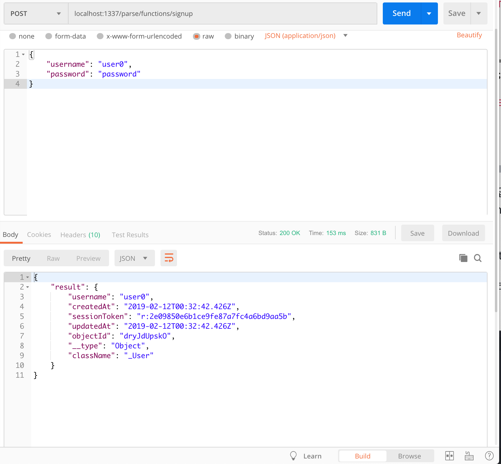
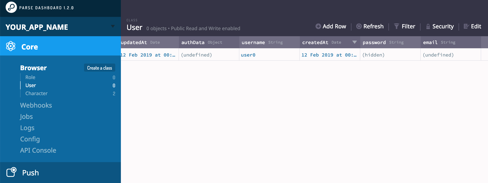
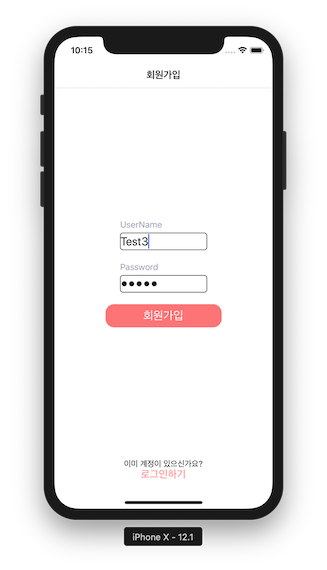
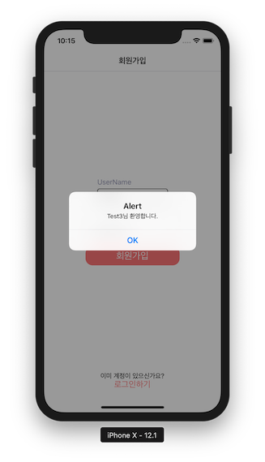
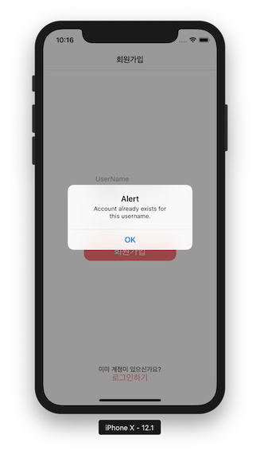
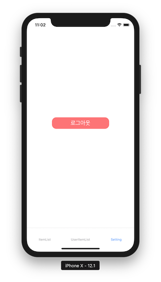
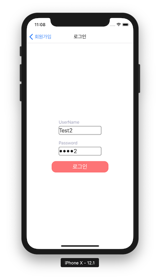
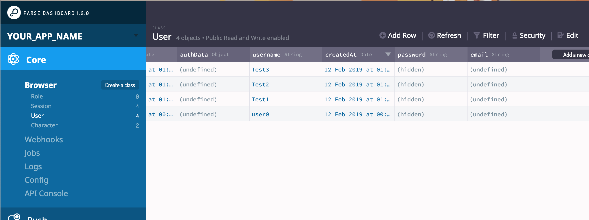

# React Native 애플리케이션과 서버 통신 튜토리얼 3

앞 튜토리얼에서는 기본적인 구성과 화면 설정을 위해

1. React Navigation 적용
2. 스타일 정의
3. 유저 정보에 따른 화면 분기하기
3. 회원가입 화면 구성하기

를 해 보았습니다. 이제는 본격적으로 서버와의 통신을 통한 회원가입, 로그인, 로그아웃을 구현해보도록 하겠습니다.

## 회원가입 동작

 로그인 기능 을 구현하는 것은 생각보다 많은 수고를 필요로 합니다. Parse Server 에서는 세션 기반의 유저 관리 기능이 구현되어 있으므로 큰 수고 없이 편리하게 사용할 수 있습니다.

### 1. Parse.User

`Parse`에는 `User`라는 사용자 관련 오브젝트가 미리 정의되어 있습니다. 회원 가입, 로그인, 유저 정보 업데이트 관련 함수를 통해 유저를 관리할 수 있으며 자세한 사항은 공식 문서를 통해 확인 가능합니다.
[Parse User](https://docs.parseplatform.org/js/guide/#users)

### 2. 회원가입 api 만들기

회원가입은 유저네임과 패스워드를 User 객체에 set 후 `signUp` 함수를 통해 가능합니다. 아래 예제를 참고하세요.

https://docs.parseplatform.org/js/guide/#signing-up

```js
var user = new Parse.User();
user.set("username", "my name");
user.set("password", "my pass");
user.set("email", "email@example.com");

// other fields can be set just like with Parse.Object
user.set("phone", "415-392-0202");
try {
  await user.signUp();
  // Hooray! Let them use the app now.
} catch (error) {
  // Show the error message somewhere and let the user try again.
  alert("Error: " + error.code + " " + error.message);
}
```

이제 이 예제와 유사하게 저희  Parse Server에서 회원가입 API를 구현해보도록 하겠습니다.

Parse Server 프로젝트에서 코드를 추가하세요.

cloud/functions/index.js

```js
Parse.Cloud.define('signup', async (req) => {
  const user = new Parse.User();
  const username = req.params.username;
  const password = req.params.password;

  user.set("username", username);
  user.set("password", password);

  if (username == null || password == null) {
    throw Error('There is wrong inputs');
  }

  try {
    const result = await user.signUp();
    return result;
  } catch (error) {
    console.log("Error: " + error.code + " " + error.message);
    throw error;
  }
});
```

signup을 통해 회원 가입을 시도하고 결과를 리턴하는  함수입니다.
인자로 username, password를 받는것을 볼 수 있습니다.
password나 username을 적지 않은 경우 에러를 리턴하는 로직을 추가하여 잘못된 호출을 방지하였습니다.

앞에서 했던것처럼 postman을 통해 테스트 해봅시다.


대쉬보드에서도 가입된 것을 확인할 수 있습니다.


이제 이 함수를 호출하는 코드를 클라이언트에 회원가입 화면에 적용하도록 하겠습니다.

### 3. 클라이언트에 회원가입 적용하기

React Native 클라이언트에 위에서 만든 회원가입 api를 호출하고 결과를 받아오는 함수를 만들겠습니다.
`Parse.User.enableUnsafeCurrentUser()`를 클래스 정의 위에 추가해주시고 클래스 내에 `signUp` 함수를  추가해주세요.

enableUnsafeCurrentUser는 유저 정보를 Parse SDK에서 로컬 스토리지에 저장하고 사용할 수 있게 해주는 것입니다.
https://docs.parseplatform.org/js/guide/#current-user

srcs/libs/parseApi.js

```js
Parse.User.enableUnsafeCurrentUser(); // https://docs.parseplatform.org/js/guide/#current-user

class ParseApi {
  static sayHello = async () => {
    const response = await Parse.Cloud.run('hello');
    return response;
  }

  static checkCurrentUser = async () => {
    try {
      const result = await Parse.User.currentAsync(); // https://docs.parseplatform.org/js/guide/#current-user
      return result === null ? false : true;
    } catch (error) {
      throw error;
    }
  }

  static signUp = async ({ username, password }) => {
    try {
      const result = await Parse.Cloud.run('signup', { username, password });
      Parse.User.become(result.get('sessionToken'));
      return result;
    } catch (error) {
      console.log("Error: " + error.code + " " + error.message);
      throw error;
    }
  }
}
```

여기서 result는 Parse.User  오브젝트로 리턴되어 get을 통해 인자에 접근할 수 있습니다. 가령 result.get('username') 이런 식입니다.
`Parse.User.become(result.get('sessionToken'));` 부분은 유저 정보를 클라이언트에 저장하기 위해 사용하였습니다.
-[Parse Current User](https://docs.parseplatform.org/js/guide/#setting-the-current-user)


다음으로 SignUpScreen의 signUp 함수 부분에 내용도 추가해줍시다.

srcs/screens/SignUpScreen.js

```js
signUp = async () => {
    const userInfo = {
      username: this.state.username,
      password: this.state.password,
    }

    if (userInfo.username == '' || userInfo.password =='') {
      alert('아이디와 패스워드를 올바르게 기입해주세요.')
      return ;
    }

    try {
      const result = await ParseApi.signUp(userInfo);
      alert(`${result.get('username')}님 환영합니다.`);
    } catch (error) {
      alert(error.message);
    }
  }
```

이제 아이디와 패스워드를 회원가입화면에서 입력하고 버튼을 누르면 서버와의 통신을 통해 회원가입이 되고 가입된 유저의 유저네임을 리턴 하게 됩니다.




같은 유저네임으로 중복해서 가입을 시도하면 이미 존재하는 유저네임이라는 에러 메세지를 볼 수 있습니다.



### 4. 회원 가입 후 메인 화면으로 돌아가기

회원 가입 후 alert 대신에 `this.props.navigation.navigate('Main')` 을 통해 메인 화면으로 돌아가도록 하겠습니다.

App.js에 Main 화면 구성을 추가해주겠습니다.

```js
const AuthStack = createStackNavigator({
  SignUp: {
    screen: SignUpScreen,
    navigationOptions: {
      title: '회원가입',
    },
  },
  LogIn: {
    screen: LogInScreen,
    navigationOptions: {
      title: '로그인',
    },
  },
});

const ItemListStack = createStackNavigator({
  ItemList: ItemListScreen,
  Purchase: PurchaseScreen,
});
ItemListScreen.navigationOptions = {
  header: null,
}

const MainTap = createBottomTabNavigator({
  ItemList: {
    screen: ItemListStack,
  },
  UserItemList: {
    screen: UserItemListScreen,
  }
});

export default createAppContainer(createSwitchNavigator(
  {
    AuthLoading: SplashScreen,
    Auth: AuthStack,
    Main: MainTap,
  },
  {
    initialRouteName: 'AuthLoading',
  }
));
```

회원 가입 화면에서는 alert 대신에 `this.props.navigation.navigate('Main')` 을 추가합니다.

srcs/screens/SignUpScreen.js

```js
  signUp = async () => {
    const userInfo = {
      username: this.state.username,
      password: this.state.password,
    }

    if (userInfo.username == '' || userInfo.password =='') {
      alert('아이디와 패스워드를 올바르게 기입해주세요.')
      return ;
    }

    try {
      const result = await ParseApi.signUp(userInfo);
      // alert(`${result.get('username')}님 환영합니다.`);
      this.props.navigation.navigate('Main');
    } catch (error) {
      alert(error.message);
    }
  }
```

SplashScreen에서도 유저 정보가 있을 시 `this.props.navigation.navigate('Main');`로 넘어가도록 코드를 수정하겠습니다. 이제 앱을 재실행 시키면

Splashscreen에서 유저 정보 유무를 확인 후 바로 Main 화면의 ItemList 탭으로 넘어가게 됩니다.

srcs/screens/SplashScreen.js

```js
 componentDidMount = async () => {
    const result = await ParseApi.checkCurrentUser();

    if (result === true) {
      this.props.navigation.navigate('Main'); // Add
    } else {
      Alert.alert(
        '유저 정보 없음',
        '유저 정보가 없습니다.',
        [
          {
            text: '가입하기',
            onPress: () => {
              this.props.navigation.navigate('Auth');
            }
          },
        ],
        {cancelable: false},
      );
    }
  }
```

## 로그아웃

현재 앱을 재실행하면 저장된 유저 정보 때문에 SplashScreen의 로직을 통해 바로 메인화면으로 넘어가게 됩니다. 로그아웃을 할 수 있도록 파일을 추가하도록 하겠습니다.

### 1. 로그아웃 함수 추가

srcs/libs/parseApi.js의  `ParseApi class` 안에 추가합니다.

```js
 static logOut = async () => {
    return Parse.User.logOut();
  }
```

### 2. Setting 화면 추가

srcs/screens/SettingScreen.js를 새로 만들어주세요.

```js
import React, {
  Component
} from 'react';
import {
  Text,
  View,
  TouchableOpacity,
  TextInput,
} from 'react-native';

import ParseApi from '../libs/parseApi';
import { themeStyles } from '../styles'

export default class SettingScreen extends Component {
  logOut = async () => {
    try {
      await ParseApi.logOut();
      this.props.navigation.navigate('Auth');
    } catch (error) {
      alert(error.message);
    }
  }

  render() {
    return (
      <TouchableOpacity onPress={this.logOut}>
        <View style={themeStyles.buttonContainer}>
          <Text style={themeStyles.buttonText}>로그아웃</Text>
        </View>
      </TouchableOpacity>
    )
  }
}
```

### 3. Setting 화면을 탭에 추가하기

App.js에 방금 만든 SettingScreen을 새로운 탭으로 추가해줍니다.

```js
...
import SettingScreen from './srcs/screens/SettingScreen';
...
const MainTap = createBottomTabNavigator({
  ItemList: {
    screen: ItemListStack,
  },
  UserItemList: {
    screen: UserItemListScreen,
  },
  Setting: {
    screen: SettingScreen,
  }
});
```

이제 해당 탭에서 로그아웃 버튼을 누르면 회원가입 화면으로 돌아가는 것을 볼 수 있습니다.



## 로그인

회원가입을 완료했으니 로그인을 구현하도록 하겠습니다. 로그인은 `Parse.User.logIn`에 username, password를 인자로 사용합니다.

### 1. 로그인 함수 추가

srcs/libs/parseApi.js

```js
  static logIn = async ({ username, password }) => {
    return Parse.User.logIn(username, password);
  }
```

### 2. 로그인 화면 업데이트

srcs/screens/LogInScreen.js 을 회원가입 화면과 유사하게 수정해줍니다.

```js
import React, {
  Component
} from 'react'
import {
  Text,
  View,
  StyleSheet,
  TouchableOpacity,
  TextInput,
} from 'react-native'

import ParseApi from '../libs/parseApi';
import { themeStyles } from '../styles'

export default class LogInScreen extends Component {
  static state = {
    username: '',
    password: '',
  }

  logIn = async () => {
    const userInfo = {
      username: this.state.username,
      password: this.state.password,
    }

    if (userInfo.username == '' || userInfo.password =='') {
      alert('아이디와 패스워드를 올바르게 기입해주세요.')
      return ;
    }

    try {
      const result = await ParseApi.logIn(userInfo);
      this.props.navigation.navigate('Main');
    } catch (error) {
      alert(error.message);
    }
  }

  render() {
    return (
    <View style={themeStyles.container}>
      <View style={{...themeStyles.centerContainer, flex: 1}}>
        <View>
          <Text style={themeStyles.textLabel}>UserName</Text>
          <TextInput
            style={themeStyles.textInput}
            onChangeText={(username) => this.setState({username})}
          />
          <Text style={themeStyles.textLabel}>Password</Text>
          <TextInput
            secureTextEntry={true}
            style={themeStyles.textInput}
            onChangeText={(password) => this.setState({password})}
          />
        </View>
        <TouchableOpacity onPress={this.logIn}>
          <View style={themeStyles.buttonContainer}>
            <Text style={themeStyles.buttonText}>로그인</Text>
          </View>
        </TouchableOpacity>
      </View>
    </View>
    )
  }
}
```

### 3. 로그인 테스트

이제 유저 정보가 없을시 나오는 회원가입화면에서 로그인하기를 눌러 로그인을 테스트해봅니다.



알맞은 정보를 입력하면 정상적으로 메인으로 넘어가는 것을 확인할 수 있습니다.



대쉬보드에서도 지금까지 가입한 유저 정보를 확인 가능합니다.
Password는 암호화되어 관리자라도 복호화된 내용을 확인할 수 없습니다.

## Conclusion

지금까지 서버와의 통신을 통한 회원가입, 로그인, 로그아웃 을 구현해 보았습니다. 다음은 로그인한 유저가 데이터에 접근하여 유저 동작에 따라 데이터를 수정하는 과정을 다뤄보도록 하겠습니다.
